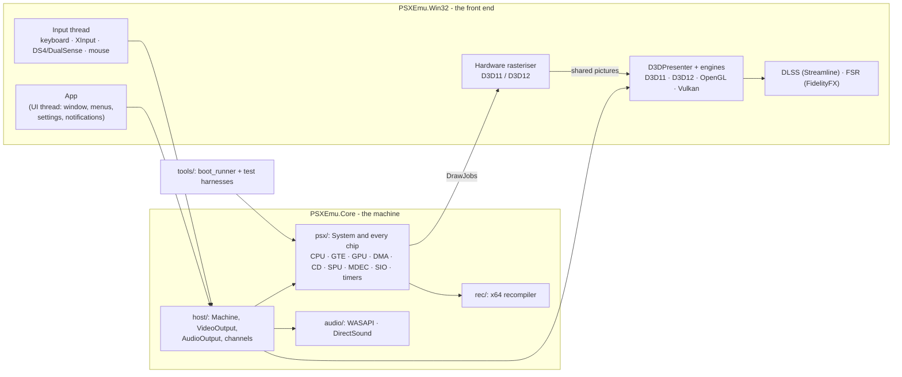
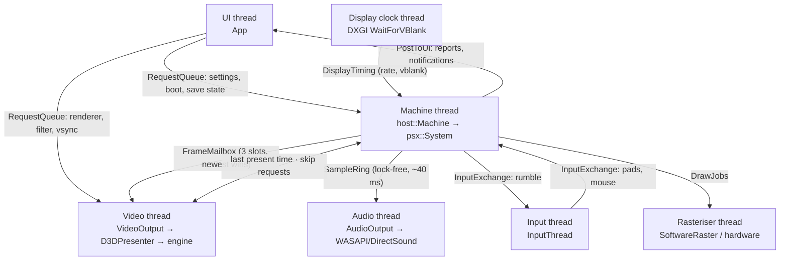
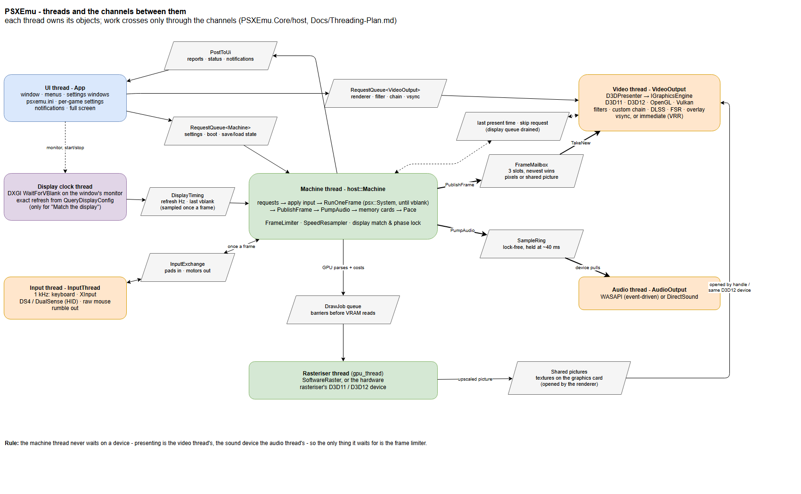
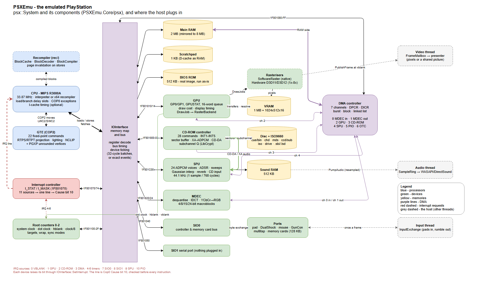
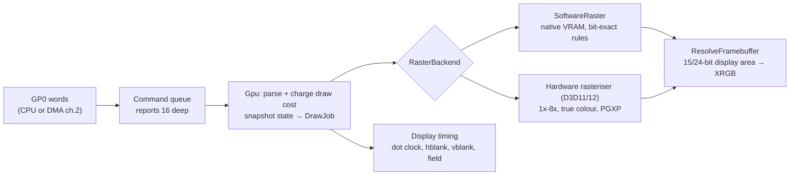
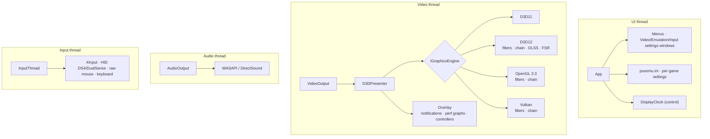
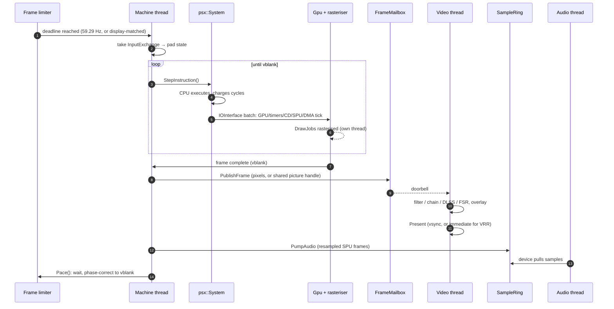

# How PSXEmu works

A technical tour of the emulator: what each part of the PlayStation does, how this emulator
models it, and how the pieces of the program fit together and talk to each other.

- **Diagrams:** the two main ones are drawn in [Architecture.drawio](Architecture.drawio), which
  opens in [draw.io / diagrams.net](https://app.diagrams.net) or its desktop app. Its two pages are
  the console's components and the program's threads, shown here as
  [Architecture-components.png](Architecture-components.png) and
  [Architecture-threads.png](Architecture-threads.png); re-export them after editing it. The
  smaller diagrams are Mermaid, written into this file, which GitHub and most Markdown viewers
  draw.
- **Where each file is:** [Project-Layout.md](Project-Layout.md) lists every file and folder. This
  document explains what they do, and links the plans and bug write-ups that say why.
- **Written 2026-10-09**, against the tree after bugs 148 (frame pacing, filter chain) and 149
  (LibCrypt). Numbers quoted here come from the code; where a figure is a model rather than a
  measurement, it says so.

---

## Contents

1. [The big picture](#1-the-big-picture)
2. [The threads, and how they talk](#2-the-threads-and-how-they-talk)
3. [The machine core: one instruction at a time](#3-the-machine-core-one-instruction-at-a-time)
4. [The memory map and the bus](#4-the-memory-map-and-the-bus)
5. [The emulated hardware, part by part](#5-the-emulated-hardware-part-by-part)
   - [CPU (R3000A)](#51-cpu-mips-r3000a) · [Recompiler](#52-the-recompiler) ·
     [GTE](#53-gte-geometry-transformation-engine) · [GPU](#54-gpu) ·
     [DMA](#55-dma-controller) · [CD-ROM](#56-cd-rom-controller-and-disc-images) ·
     [SPU](#57-spu-sound) · [MDEC](#58-mdec-motion-decoder) ·
     [SIO0 controllers and cards](#59-sio0-controllers-and-memory-cards) ·
     [SIO1](#510-sio1-serial-port) · [Timers](#511-root-counters-timers) ·
     [Interrupts](#512-interrupt-controller) · [BIOS](#513-bios-and-kernel)
6. [Around the machine: state, cards, cheats, debugger](#6-around-the-machine)
7. [The front end](#7-the-front-end)
8. [Enhancements: beyond the console](#8-enhancements-beyond-the-console)
9. [A frame's journey, end to end](#9-a-frames-journey-end-to-end)
10. [Testing and determinism](#10-testing-and-determinism)

---

## 1. The big picture

PSXEmu is a **low-level emulator**: it runs a real PlayStation BIOS image and the game's own code
on a model of the console's chips. Nothing of the game or the BIOS is replaced by a host
reimplementation ("HLE"). BIOS calls are watched and logged, never intercepted.

The source is split in two, and the split is enforced:

| | `PSXEmu.Core` (static library) | `PSXEmu.Win32` (the application) |
|---|---|---|
| **What** | The whole machine, the threads that run it, sound devices, settings | Window, menus, settings windows, four renderers, the hardware rasteriser, input, overlay, DLSS and FSR |
| **Knows about** | No window, no graphics API, no UI framework | The core, through a few narrow interfaces |
| **Tested by** | 20+ headless harnesses in `PSXEmu.Core/tools` | The same harnesses for its header-only parts, and by driving the real app |



Two rules shape everything:

- **The machine is deterministic and knows no clock.** `System::StepInstruction` runs one
  instruction and whatever it causes, with no wall-clock throttling. The same BIOS and disc give
  the same instructions, the same sectors and the same pictures on every run. That is what lets a
  headless harness check a game by checksum, and it is why pacing, sound devices and windows all
  live outside `psx/`.
- **Enhancements never change what the game sees.** Upscaling, PGXP, true colour, DLSS, FSR,
  filters and frame pacing all act on what the machine produced. The machine runs the same
  instructions with them on or off ([section 8](#8-enhancements-beyond-the-console)).

---

## 2. The threads, and how they talk

Since [Threading-Plan.md](Threading-Plan.md) the front end runs on separate threads. Each owns
its objects outright; nothing is shared under a lock except where a channel says so.

| Thread | Owns | Wakes on |
|---|---|---|
| **UI** (`App`) | The window, menus, settings windows, `psxemu.ini`, the display clock's control | Window messages, and work posted to it (`PostToUi`) |
| **Machine** (`host::Machine`) | `psx::System`: every chip, VRAM, RAM, the frame limiter | Its request queue; otherwise it runs frames back to back |
| **Video** (`host::VideoOutput`) | The graphics engine (device, swap chain, filters, overlay) | A new frame in the mailbox, or a request |
| **Audio** (`host::AudioOutput`) | The sound device | The device asking for more |
| **Input** (`InputThread`) | XInput, HID pads, raw mouse | A 1 ms timer |
| **Rasteriser** (optional) | Drawing `DrawJob`s into VRAM | Jobs from the GPU (`gpu_thread`) |
| **Display clock** (`DisplayClock`) | Watching the monitor's vblanks | Each vblank (only for "Match the display" pacing) |





*The same, laid out by hand, with what each channel carries ([Architecture.drawio](Architecture.drawio),
page "Threads and data flow").*

**The channels** (`PSXEmu.Core/host`):

- **`Doorbell`**: one per thread; anything that gives a thread work rings it, so an idle thread
  sleeps rather than polls.
- **`RequestQueue<T>`**: the only way into another thread's objects. A request is a function
  run on the owning thread between frames: `machine->Post([](Machine& m) { ... })`.
- **`FrameMailbox`**: triple-buffered and lock-free. The machine always has a slot to fill; the
  video thread always takes the newest. A frame the video thread never took is counted as dropped,
  and its picture on the graphics card goes straight back to the rasteriser.
- **`SampleRing`**: single-producer, single-consumer ring of stereo samples, held at about 40 ms.
- **`InputExchange`**: the input thread's latest reading of the host devices, taken once a frame.

The rule that matters most: **the machine thread never waits on a device.** Presenting is the
video thread's and the sound device is the audio thread's, so the only thing the machine waits
for is the frame limiter.

---

## 3. The machine core: one instruction at a time

`psx::System` owns every component. A component derives from `Component` and reaches the rest of
the machine through `system()`. Settings come from `EmuConfig`, read rather than cached, so a
change takes effect without anyone being told.

### The step

`System::StepImpl` ([system.cpp](../PSXEmu.Core/psx/system.cpp)) is the heartbeat. Per step:

1. **Interrupt check, before the instruction.** Cause's pending bits are built from the interrupt
   controller's line (`I_STAT & I_MASK`) and the two software bits. If SR unmasks one and IEc is
   set, the CPU takes the exception with EPC on the instruction that has *not* run yet. Getting
   this backwards re-ran instructions and once locked interrupts off for good (bug 7).
   - **A GTE command goes first.** The hardware issues a COP2 command before it sees an
     interrupt, and the BIOS handler skips over it on return. So when the next instruction is a
     GTE command, it runs, and the interrupt is raised behind it.
2. **Debugger and BIOS calls.** The debugger may halt here. A jump to `A0h`, `B0h` or `C0h` is
   logged as a BIOS call (the function number is in `t1`).
3. **Execute.** One interpreted instruction, or a chain of compiled blocks with the recompiler on.
4. **DMA stall.** With "DMA Stops the CPU", the CPU waits out a transfer that holds the bus.

### Time, and how the devices are told about it

The CPU charges cycles as it executes: one per instruction, plus measured costs (load stalls,
multiply and divide, GTE commands, branches, bus regions). Each charge goes to
`IOInterface::Tick`, which **batches** them. Every 32 CPU cycles (`kBatchCycles`) the batch is
run (`RunPending`):

```text
RunPending(batch):
  GPU.Tick(batch)          -> beam position, hblank/vblank, drawing time paid off
  root counters             <- dot clocks and hblanks from the GPU, or CPU cycles
  CD-ROM.Tick, SIO0.Tick, SIO1.Tick, SPU.Tick, DMA.Tick
```

- **Reads are always current.** Reading a timer register runs the batch early, so software never
  sees a counter up to 32 cycles stale.
- **Exact Event Timing** (Settings > Emulation, off by default): a batch ends at the next thing
  any device has scheduled (a timer target, an hblank edge, a sector, a DMA finishing), so an
  interrupt lands on its exact cycle. `NextEventCycles` asks every device.
- **Under the recompiler** batches stretch to the next scheduled event, up to 1,024 cycles, since
  compiled code charges its cycles in bursts anyway.

### A frame

The machine thread runs `RunOneFrame`: step until the GPU's frame counter moves, which happens at
the start of vblank. Then it publishes the picture, pumps the sound, flushes memory cards and
waits out the frame limiter.

### Clocks and rates

| Quantity | Value in the emulator | Where |
|---|---|---|
| CPU clock | 33,868,800 Hz (44,100 × 768) | everywhere |
| GPU clock | CPU × 11/7 = 53.22 MHz | `Gpu::kGpuClockNumerator/Denominator` |
| Scanline | 3,413 GPU clocks | `kDotsPerScanline` |
| Lines per frame | 263 NTSC, 314 PAL | `gpu.cpp` |
| Refresh | 59.29 Hz NTSC, 49.76 Hz PAL | `Gpu::refresh_hz()` |
| Dot clock dividers | 10, 8, 5, 4 GPU clocks a dot (256, 320, 512, 640 wide) | `gpu.h` |
| SPU sample | every 768 CPU cycles (44,100 Hz) | `Spu::kCyclesPerSample` |
| CD sector | 451,584 cycles single speed (75/s), half at double speed | `cdrom.cpp` |

---

## 4. The memory map and the bus

The R3000A sees a 4 GB address space through three windows onto the same physical bus:

| Segment | Virtual range | Cached | Used for |
|---|---|---|---|
| KUSEG | `0000_0000`-`7FFF_FFFF` | yes | Games usually run here |
| KSEG0 | `8000_0000`-`9FFF_FFFF` | yes | Kernel and games |
| KSEG1 | `A000_0000`-`BFFF_FFFF` | no | I/O, the BIOS at reset (`BFC0_0000`) |
| KSEG2 | `FFFE_0000`... | - | Cache control register `FFFE_0130` |

Physical addresses, as `IOInterface` decodes them:

| Physical | Size | What |
|---|---|---|
| `0000_0000` | 2 MB, mirrored ×4 to 8 MB | Main RAM |
| `1F00_0000` | 8 MB window | Expansion 1 (parallel port): a readable buffer, nothing behind it |
| `1F80_0000` | 1 KB | Scratchpad: the R3000A's data cache, used as fast RAM |
| `1F80_1000` | 36 bytes | Memory control: base addresses and per-region access timing |
| `1F80_1040` / `1050` | | SIO0 (controllers, cards) / SIO1 (serial port) |
| `1F80_1060` | | RAM size |
| `1F80_1070` / `1074` | | Interrupt status `I_STAT` / mask `I_MASK` |
| `1F80_1080`-`10FF` | | DMA: seven channels, `DPCR` at `10F0`, `DICR` at `10F4` |
| `1F80_1100`-`112F` | | Root counters 0-2 |
| `1F80_1800`-`1803` | | CD-ROM controller (index-banked registers) |
| `1F80_1810` / `1814` | | GPU: GP0 / GPUREAD, GP1 / GPUSTAT |
| `1F80_1820` / `1824` | | MDEC command-data / control-status |
| `1F80_1C00`-`1FFF` | | SPU registers |
| `1F80_2000` | | Expansion 2 (POST display, DUART) |
| `1FC0_0000` | 512 KB | BIOS ROM |

`IOInterface` ([io_interface.cpp](../PSXEmu.Core/psx/io_interface.cpp)) does the decode, keeps a
per-register read and write tally (so a register nobody touches can be told from one nobody
implements), and synthesises byte and halfword access to the 32-bit DMA registers.

**Bus timing.** Every region's access time comes from its memory-control register, by psx-spx's
formula. Optional finer models ("Measured Bus Timing", "Write Queue Timing") are in Settings >
Emulation, off by default; see [CPU-Timing-Plan.md](CPU-Timing-Plan.md).

---

## 5. The emulated hardware, part by part

Each part below has two halves: **the console**, what the real chip does, and **here**, how this
emulator models it and where the model stops.



*The console's components: the bus, each device and its memory, the DMA paths (purple), the interrupt
lines (red) and where the host's threads plug in. Edit it in [Architecture.drawio](Architecture.drawio),
page "PlayStation components".*

### 5.1 CPU (MIPS R3000A)

**The console.** A 32-bit MIPS R3000A at 33.87 MHz, with a 5-stage pipeline, 4 KB instruction
cache, a 1 KB data cache wired up as scratchpad RAM, no FPU and no MMU. Coprocessor 0 handles
exceptions; coprocessor 2 is the GTE. Its MIPS-I quirks are visible to software:

- **Branch delay slots:** the instruction after a branch always runs.
- **Load delay slots:** a loaded value reaches its register one instruction late, and the next
  instruction still sees the old value.

**Here** ([cpu.cpp](../PSXEmu.Core/psx/cpu.cpp), `cpu_context.h`):

- **An interpreter**, dispatching on opcode through member-function tables
  (`machine_instruction_main_`). Each step fetches (`StageIF`), decodes (`StageRD`) and executes.
- **Delay slots:**
  - A branch runs its delay slot inside the same `ExecuteInstruction`, so an interrupt never lands
    between them.
  - Load delays are modelled exactly: a pending load is held and committed one instruction later,
    a write to the same register in the slot wins, and `lwl`/`lwr` forward correctly (bug 32).
- **Exceptions:** `RaiseException` sets EPC (with the BD bit for a delay slot), pushes SR's
  KU/IE stack and vectors to `80000080` (or `BFC00180` with BEV set). `Cause` is composed when
  read: the controller's line as bit 10, software interrupts as bits 8-9 (bug 84).
- **Timing:**
  - One cycle per instruction, plus measured costs:
    - multiply and divide: 6, 9, 13 or 36 cycles, by the size of the operands;
    - every GTE command its documented cost, with the stall when the next comes too soon;
    - a cycle for a branch, taken or not;
    - load stalls by bus region.
  - amidog's CPU suite passes in full, its TIMING group included.
  - The instruction cache can be timed too (256 lines, refill to the end of the line), as an
    option. It is never used to supply instructions, so stale code can't run from it.

### 5.2 The recompiler

**Here** ([Recompiler-Plan.md](Recompiler-Plan.md), `PSXEmu.Core/rec`): an x64 dynamic
recompiler, kept apart from the core on purpose: nothing in `rec/` includes anything from `psx/`.
`recompiler_bridge.h` is the one file that knows both.

```text
dispatch:  look up guest PC in BlockCache
           └─ missing → BlockDecoder: guest words → block (up to a branch + delay slot)
                         BlockCompiler: block → x64 (register allocator, inline RAM/scratchpad,
                                         GTE commands, lwl/lwr/swl/swr, delay-slot loads)
           run block → returns next guest PC and cycles used
           anything it can't compile → the interpreter, one instruction
```

- **Invalidation** is by the word. A store first asks a page bitmap whether its 4 KB page holds
  compiled code at all; if it does, the page knows which of its words each block was compiled from,
  and the store throws away exactly the blocks whose words it wrote. Games keep data beside code:
  throwing the whole page away made Final Fantasy VII's battle recompile 515 blocks a frame
  (bug 140). A write to the cache-control register, how software says it has loaded new code,
  throws everything away.
- **Ticking is in bursts.** Compiled code doesn't tick the devices as it goes; its cycles are
  charged afterwards. Interrupts land at block boundaries.
- **The caveat.** The two CPUs aren't cycle-identical: compiled code runs 14-19% more
  instructions in the same frames. Even so, on the twelve-disc regression table both give the
  same picture at every checkpoint. It runs games at 3-5× real time against about 1.3× for the
  interpreter, and stays opt-in.

### 5.3 GTE (Geometry Transformation Engine)

**The console.** Coprocessor 2: fixed-point vector and matrix maths for 3D. It has 32 data and
32 control registers and 22 commands:

| Commands | What they do |
|---|---|
| RTPS, RTPT | Rotate, translate, perspective-project one or three vertices |
| NCLIP | Winding order, for backface culling |
| AVSZ3, AVSZ4 | Average Z, for the ordering table |
| MVMVA | Matrix × vector |
| NCS, NCT, NCCS, NCCT, NCDS, NCDT, CC, CDP | Lighting |
| DPCS, DPCT, INTPL, DCPL | Depth cueing (fog) |
| SQR, OP | Square, outer product |
| GPF, GPL | General-purpose interpolation |

Results saturate into a FLAG register. Division is an unsigned Newton-Raphson reciprocal off a
257-entry table. Projected screen positions come out **rounded to whole pixels** into the SXY
FIFO, which is where PlayStation "wobble" comes from.

**Here** ([gte.cpp](../PSXEmu.Core/psx/gte.cpp)):

- All 22 commands, with the register read-back quirks (H sign-extends, ORGB/LZCR read-only, SXYP
  pushes the FIFO), the 44-bit accumulator overflow checks mid-sum, and each command's cycle cost.
- amidog's `psxtest_gte` passes its REG, COMPLEX, TIMING and OPCODE groups.
- Only MVMVA's "garbage" matrix (select 3) is written from the description, not a measurement.
- With PGXP on, the GTE also keeps each projected vertex's **unrounded** position beside the
  rounded one ([section 8](#8-enhancements-beyond-the-console)).

### 5.4 GPU

**The console.** A 2D rasteriser with 1 MB of VRAM, seen as a 1024×512 grid of 16-bit pixels.
There is no 3D in it: the CPU and GTE project everything, and the GPU draws flat, Gouraud-shaded
and textured triangles, quads, lines and rectangles. It has 4-, 8- and 15-bit textures with CLUTs,
four semi-transparency modes, dithering, a mask bit, a drawing area and offset, and a texture
window. The display shows a rectangle of VRAM at 256-640 × 240/480 in 15- or 24-bit colour.

- **GP0** takes drawing commands and VRAM transfers through a 16-word FIFO.
- **GP1** takes display control.
- **GPUSTAT** reports readiness, the interlace field and DMA requests.

**Here** ([gpu.cpp](../PSXEmu.Core/psx/gpu.cpp), `raster.h`): the GPU is split in two.



- **`Gpu` is the console's GPU.** It owns:
  - GP0/GP1 and GPUSTAT;
  - the command queue (16 words reported, so DMA channel 2 pauses when it is "full");
  - the display timing: dot clock, hblank and vblank, the interlace field;
  - **what every draw costs**: a setup cost by shape, then per-pixel costs that rise with
    texturing and blending, charged on the area actually inside the drawing area (bugs 85-89).
    The rasteriser pays it off at two pixels a CPU cycle, and GPUSTAT's ready bits drop while it
    owes time. Some games wait on exactly that.
- **A `RasterBackend` only makes pixels.** `Gpu` parses each command into a fixed-size `DrawJob`
  (triangle, line, rectangle, fill, VRAM copy), with a snapshot of the state it was issued under,
  so a backend running behind on another thread draws what was asked.
  - **`SoftwareRaster`** draws into native VRAM with the console's rules: the top-left fill rule,
    the dither matrix, mask set and check, semi-transparency, texture windows, CLUT lookups.
  - **The hardware rasteriser** draws the same jobs on the host GPU at 1x-8x
    ([section 8](#8-enhancements-beyond-the-console)). Either way, native VRAM stays the truth the
    rest of the machine reads.
- **Display.** At the start of vblank the visible rectangle is resolved out of VRAM into 32-bit
  pixels: 15-bit or 24-bit, with the horizontal range from GP1(06) and the dot clock. A 480-line
  interlaced picture is two fields; in that mode the rasteriser skips the field being displayed,
  as hardware does (bug 89).
- **Known simplifications** (in [Gaps.md](Gaps.md)): Gouraud colour is interpolated per pixel
  rather than stepped along each line in fixed point, so a few pixels differ by one colour step
  from hardware. Nobody would see it, but a checksum against hardware would.

### 5.5 DMA controller

**The console.** Seven channels move data between RAM and the devices without the CPU:

| Ch. | Device | Typical use |
|---|---|---|
| 0 | MDEC in | Compressed macroblocks to the decoder |
| 1 | MDEC out | Decoded pixels back to RAM |
| 2 | GPU | Display lists (linked-list mode), texture uploads (block mode) |
| 3 | CD-ROM | Sector data to RAM |
| 4 | SPU | Sound samples to and from sound RAM |
| 5 | PIO | Expansion port |
| 6 | OTC | Clears an ordering table: a reversed linked list for the GPU |

There are three transfer modes: burst (all at once), block (sliced on the device's request), and
linked list (follow headers through RAM, GPU only). `DPCR` sets priorities and enables; `DICR`
gathers the completion interrupts.

**Here** ([dma.cpp](../PSXEmu.Core/psx/dma.cpp)):

- **Data moves eagerly, completion is paced.** A transfer's busy bit and interrupt wait for its
  modelled duration of about a cycle a word, plus page and linked-list node costs (bug 38).
- **Request-mode channels wait for their device:**
  - channel 2 pauses when the GPU queue is full and resumes as the rasteriser makes room;
  - channel 0 feeds the MDEC a block at a time;
  - channel 1 waits for decoded output;
  - channel 4 is paced by the SPU (bug 145).
- **DICR's master flag** follows the hardware rule: any channel's flag, gated by the master
  enable (bug 55).
- **Not modelled:** chopping (CHCR bit 8), and the PIO channel moving any data.

### 5.6 CD-ROM controller and disc images

**The console.** A Sony CXD controller behind four index-banked registers. Software writes a
command and its parameters into FIFOs, and gets answers as interrupts: INT3 acknowledge, INT2
complete, INT1 data ready, INT4 end of data, INT5 error. It reads 2,352-byte sectors at 75 or 150
a second. It also plays CD-DA audio, and decodes XA-ADPCM interleaved audio straight into the SPU.
The drive reports its position from each sector's **subchannel Q**.

**Here** ([cdrom.cpp](../PSXEmu.Core/psx/cdrom.cpp), [disc.cpp](../PSXEmu.Core/psx/disc.cpp),
[iso9660.cpp](../PSXEmu.Core/psx/iso9660.cpp)):

- **All 28 commands**, with a response queue timed in CPU cycles: Getstat, Setloc, ReadN/ReadS,
  SeekL/SeekP, Play, GetlocL/P, GetTN/TD, GetQ, Setfilter, Setmode, Pause/Stop/Init and more.
  - Sector delivery honours unacknowledged interrupts: a sector waits in the buffer until its INT1
    is acknowledged (bug 139).
  - "Mechanical timing" (spin-up, seek distance) is optional.
- **Audio:**
  - **XA-ADPCM:** 4- and 8-bit, mono and stereo, 37.8 and 18.9 kHz, with filter history across
    sectors, Setfilter respected. Resampled to 44.1 kHz into the SPU's CD input.
  - **CD-DA:** read from audio tracks and mixed the same way.
- **Position reports** (GetlocP, and the reports while audio plays): from a CloneCD `.sub` when
  there is one, otherwise worked out from the track layout, pregaps included. A sector whose Q
  fails its CRC is skipped back over, as the drive does. That is all LibCrypt copy protection
  reads, and why an `.sbi` patch beside a rip makes protected games work (bug 149).
- **Disc images** (`Disc`):

  | Format | Notes |
  |---|---|
  | `.cue` + `.bin` | Multi-track, multi-file, pregaps from INDEX 00 |
  | `.chd` | Through libchdr; zstd-compressed is refused |
  | `.mds`/`.mdf` | Alcohol 120%, track list and sector stride |
  | `.ccd`/`.img`/`.sub` | CloneCD, with the subchannel used for positions |
  | `.bin`/`.img`/`.iso` | Bare; the data track's end is found by scanning |
  | Drive letter | A physical drive; data tracks only |
  | `.sbi`/`.lsd` beside any of these | LibCrypt subchannel patch |

  Images are read through a 32-sector read-ahead, since they usually sit on a network share.
- **ISO9660** reads the filesystem, so `SYSTEM.CNF` and the boot executable can be found (for the
  harness's direct boot, and for the game's serial and title).

### 5.7 SPU (sound)

**The console.**
- **Voices:** 24 ADPCM voices (16-byte blocks of 28 samples each), with pitch, ADSR envelopes,
  volume sweeps, noise and pitch modulation.
- **Mixer:** 4-point Gaussian interpolation, a reverb network working in sound RAM, and the CD
  audio input mixed in.
- **Memory and output:** 512 KB of sound RAM; 44.1 kHz stereo out.
- **IRQ:** an interrupt when a voice or transfer touches a chosen address.

**Here** ([spu.cpp](../PSXEmu.Core/psx/spu.cpp)):

- One stereo frame every 768 CPU cycles.
- ADPCM decode with loop points that survive key-on (bug 39), ADSR, the hardware's Gaussian table,
  noise, pitch modulation, volume sweeps (bug 101), the full reverb network at 22,050 Hz (bug 102),
  CD input, the IRQ address and channel 4 transfers.
- A silent voice keeps running so it can still reach the IRQ address (bug 144).
- Samples go to the machine thread's `PumpAudio`, are resampled for the emulation speed
  (`SpeedResampler`) and go into the `SampleRing`.
- **Not done:** CD audio is resampled linearly rather than with the hardware's filter, and nothing
  has been compared by ear against a console.

### 5.8 MDEC (motion decoder)

**The console.** Decodes film frames one 16×16 macroblock at a time. Software has already
undone the Huffman coding. The MDEC dequantises, runs the inverse DCT, converts YCbCr to RGB and
packs 4-, 8-, 15- or 24-bit pixels. Data goes in on DMA channel 0 and out on channel 1.

**Here** ([mdec.cpp](../PSXEmu.Core/psx/mdec.cpp)): every decode command, the quantisation and
scale tables, colour and monochrome, all output depths. A macroblock is decoded when its last word
arrives; channel 0's pacing charges each one about 2,688 cycles. That is a model of the timing,
not a measurement (see [Gaps.md](Gaps.md)).

### 5.9 SIO0: controllers and memory cards

**The console.** One serial port, 250 kHz, shared by both controller ports and both memory card
slots. The device is chosen by its first byte (`01h` controller, `81h` card), and each byte
exchanged is acknowledged with an interrupt.

**Here** ([sio.cpp](../PSXEmu.Core/psx/sio.cpp), [mc.cpp](../PSXEmu.Core/psx/mc.cpp)):

- **Devices:**
  - digital pad, Dual Analog, DualShock (analog negotiation, config mode `43h`-`4Dh`, rumble, an
    ANALOG button);
  - mouse;
  - multitap (four players, four card slots a port);
  - GunCon (the beam position, from the GPU's timing);
  - nothing.
- **Memory cards:**
  - Each slot holds a 128 KB card in memory and answers read, write and ID commands.
  - Cards are written whole, atomically, a second after the game stops writing.
  - Each disc gets its own pair under `Documents\My Games\PSXEmu\memcards\<disc>\`.
- **The host side** (`InputExchange`, bindings) maps keyboard keys, XInput pads, DualShock 4 and
  DualSense pads (read straight from HID), and the mouse onto each port.

### 5.10 SIO1 (serial port)

**The console.** The serial ("link cable") port. **Here:** a port with nothing plugged in. Its
registers, status and baud timer behave correctly, and what software transmits can be shown in the
BIOS console window. There is no link cable between two instances.

### 5.11 Root counters (timers)

**The console.** Three 16-bit counters with targets, wrap and IRQ modes, and sync modes:

| Counter | Can count | Can be gated by |
|---|---|---|
| 0 | System clock or dot clock | hblank |
| 1 | System clock or hblanks | vblank |
| 2 | System clock or clock / 8 | - |

**Here** ([root_counter.h](../PSXEmu.Core/psx/root_counter.h)): counters 0 and 1 are driven by the
GPU's own dot clock and hblank counts, not estimated from CPU cycles. Reads run the pending batch,
so they are exact. JaCzekanski's timer tests and `timer_test` (80 checks) pass, and with Exact
Event Timing an interrupt lands on its cycle.

### 5.12 Interrupt controller

**The console.** Eleven sources in `I_STAT`, each masked by `I_MASK`, ORed into the CPU's single
interrupt input:

| Bit | 0 | 1 | 2 | 3 | 4-6 | 7 | 8 | 9 | 10 |
|---|---|---|---|---|---|---|---|---|---|
| Source | VBLANK | GPU | CD-ROM | DMA | Timers 0-2 | SIO0 | SIO1 | SPU | Lightpen/PIO |

**Here:** `IOInterface::SetInterrupt` / `interrupt_line()`. Writing `I_STAT` acknowledges bits.
The line is Cop0 Cause bit 10, checked before every instruction ([section 3](#3-the-machine-core-one-instruction-at-a-time)).

### 5.13 BIOS and kernel

**The console.** A 512 KB ROM holding the boot code, the kernel (event, thread, file and memory
card functions reached through the `A0h`, `B0h` and `C0h` tables) and the shell (memory card manager,
CD player). At power-on it initialises, shows the Sony and PlayStation logos, checks the disc's
licence string and runs the executable `SYSTEM.CNF` names.

**Here:** the real BIOS image runs. `Kernel` and `bios_calls.cpp` only *watch*:

- BIOS calls are named and logged, for the debugger's call log;
- what software prints through the BIOS appears in the BIOS console window.

"Skip BIOS intro" hands off to the game at the address where the shell would start it. The BIOS
still initialises the hardware, so nothing is faked. `boot_runner --boot-disc` can also load an
executable directly, for tests.

---

## 6. Around the machine

- **Save states** (`state.h`, [Save-States-Plan.md](Save-States-Plan.md)):
  - One `StateIO`, one path for both directions: every component's `Serialise` calls the same
    functions to save and to load, so the two can't drift apart.
  - The header carries a version (old states are refused, never migrated) and a hash of the BIOS
    image.
  - Saving and loading give bit-identical results: 900 frames straight equals 600, then save,
    load, 300 more.
  - F1-F8, and a picker with thumbnails (F10).
- **Memory card manager** (`mc_directory.cpp`, the editor window): list, delete, undelete, copy,
  export and import single saves (`.mcs`, raw) and whole cards from other tools (`.gme`, `.mem`,
  `.vgs`, `.psx`).
- **Cheats** (`cheats.h`): GameShark codes per game, run every frame, all code types including
  conditionals, slides and the button-activated kind; DuckStation and RetroArch cheat files import.
- **Debugger** (`debugger.cpp`, the debugger window): breakpoints, stepping, watchpoints on
  memory, a BIOS call log, a call stack, labels and device panes. A halt happens between
  instructions, so the recompiler steps aside while the debugger is armed.
- **Settings** (`emuconfig.h`, `settings.h`): one `EmuConfig`, read from `psxemu.ini` beside the
  executable. A game can keep its own overrides in `gamesettings\<serial>.ini`.

---

## 7. The front end



- **`App`** (`app/app.cpp`) is the UI thread. It owns:
  - the window and menus, the settings windows, notifications, full screen (borderless), recent
    discs, screenshots;
  - starting and stopping the other threads.

  It never touches the machine directly: everything goes through request queues
  (`PostToMachine`, `video_->Post`, `PostToOverlay`), and comes back through `PostToUi`.
- **Renderers** (`graphics/`):
  - Four engines behind `IGraphicsEngine`: Direct3D 11, Direct3D 12, OpenGL and Vulkan, switchable
    while a game runs, each falling back to another if it can't start.
  - Each uploads the frame (or opens the hardware rasteriser's picture on the graphics card),
    letterboxes it to 4:3, applies a filter, draws the overlay and presents.
  - Direct3D 12, OpenGL and Vulkan run the **filters**: Bilinear, CRT-Lottes, Scanline, xBRZ,
    SuperEagle and Super-xBR, from HLSL, GLSL, and the same GLSL as SPIR-V. They also run the
    **custom chain** of up to four of them (bug 148).
- **Frame pacing** (bug 148):
  - The frame limiter paces the machine to the console's rate by default.
  - "Match the display" runs it at the monitor's refresh when that is within 2%, each frame held
    1 ms after the vblank that `DisplayClock` watches.
  - "Variable refresh" presents every frame the moment it is drawn, for G-Sync and FreeSync.
- **Audio** (`audio/`, `host/audio_output`): the device pulls from the `SampleRing`; the machine
  trims its resampling by up to 0.5% to hold the ring at its target.
- **Input** (`input/`): read 1,000 times a second, bound per port and per device, with rumble sent
  back to the pads.
- **The overlay** (`ui/overlay`): notifications, the controllers in each port, and a performance
  panel (frame rate, frame time split, audio buffer, CPU MIPS, memory). It is drawn by each engine
  in one small pass, in a Classic or a Glass look.

---

## 8. Enhancements: beyond the console

All of these are opt-in, and none changes what the game sees. See
[Hardware-Renderer-Plan.md](Hardware-Renderer-Plan.md), [DLSS-Plan.md](DLSS-Plan.md),
[FSR-Plan.md](FSR-Plan.md).

| Enhancement | How |
|---|---|
| **Hardware rasteriser, 1x-8x** | `DrawJob`s drawn by Direct3D 11 or 12 at a multiple of native resolution, matched to the software rasteriser pixel for pixel at 1x. Native VRAM is kept in step for CPU reads, transfers and save states. |
| **Shared pictures** | The upscaled picture stays on the graphics card: the renderer opens it by handle (D3D11/D3D12), as GL/Vulkan external memory, or on the very same D3D12 device. No read-back. |
| **True colour** | Above 1x, eight bits a channel instead of the console's five, with no dithering. On by default; the native picture the machine keeps is unchanged. |
| **PGXP** | Every register and RAM word has a *shadow* holding the GTE's unrounded vertex position. A shadow is used only while its word still holds the value it was made for. The hardware rasteriser then draws vertices where the GTE really put them: no wobble, perspective-correct textures, optionally precise culling. |
| **Motion and depth planes** | Beside VRAM: per-pixel depth (from PGXP) and motion (from the GTE, and 2D matching). The inputs DLSS and FSR need. |
| **NVIDIA DLSS** | Super Resolution, DLAA and Frame Generation through Streamline, in the D3D12 renderer. |
| **AMD FSR** | Upscaling, native AA and Frame Generation through FidelityFX, from the same inputs. |
| **Filters, chain, pacing** | Section 7. |

---

## 9. A frame's journey, end to end



1. **The frame starts** when the limiter's deadline passes. In "Match the display" mode that
   deadline is nudged toward 1 ms after the display's vblank.
2. **Input:** the machine takes the input thread's latest reading and sets the pads.
3. **Emulation:** it steps instructions until the GPU reaches vblank, a few milliseconds of host
   time. The rasteriser draws in parallel on its own thread.
4. **Picture:** the GPU resolves the display area, and the machine publishes it to the mailbox: a
   copy of the pixels, or with the hardware rasteriser, a handle to the picture on the graphics
   card.
5. **Present:** the video thread takes the newest frame, runs the filter or upscaler, draws the
   overlay and presents.
6. **Sound:** the machine pumps the SPU's samples, resampled for the speed, into the ring; the
   audio thread feeds the device from it.
7. **Wait:** the machine waits for the next deadline.

---

## 10. Testing and determinism

Because the machine is deterministic, most of it is tested without a window
([Test-Suite.md](Test-Suite.md)):

- **The emulation harnesses:** `cpu_test`, `gte_test`, `gpu_test`, `mdec_test`, `timer_test`,
  `sio_test`, `spu_test`, `media_test`, `mc_test`, `debug_test`. They drive each device through its
  own protocol: 1,800+ checks.
- **Host and front-end logic:** `host_test` (the threads and channels), `frame_limiter_test`,
  `filter_chain_test`, `bindings_test`, `dlss_choice_test`, `fsr_choice_test`, `rec_test` (2,000
  recompiler checks), `hw_raster_test` (hardware against software rasteriser, pixel for pixel, on
  WARP).
- **`boot_runner`:** boots a BIOS or a disc headless and reports everything: framebuffer
  checksums, instruction and sector counts, register tallies, traces, save states, pictures. The
  regression table is twelve discs at 3,000 frames with checksums at 1,000, 2,000 and 3,000.
- **Hardware test ROMs:** amidog's CPU and GTE suites and JaCzekanski's tests (timers, GPU, DMA,
  access time) all run under it.
- **The front end** is driven for real: launched, sent menu commands, its title bar and screen
  read back. That checks threading, pacing, renderers and settings end to end.

What still needs a person is what a picture looks like in motion and what anything sounds like.
